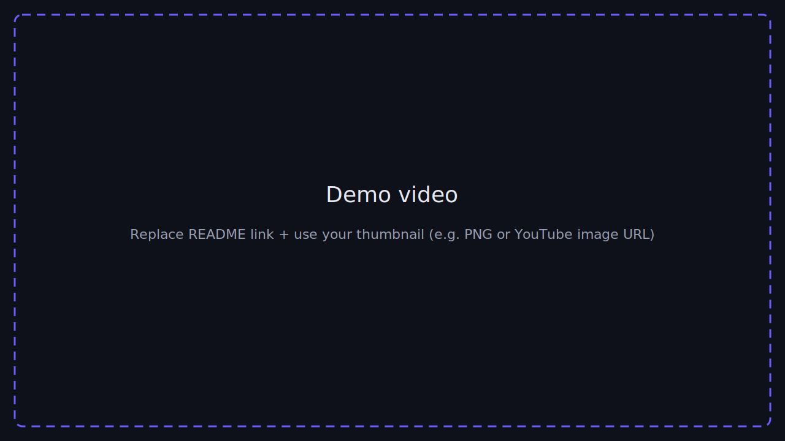

<p align="center">
  
</p>

# Mangetsu

**Mangetsu** is a cross-platform manga reader and library app built as a learning-oriented project. The UI runs as a **Vite + React** web app, ships inside an **Android** shell via **Capacitor**, and can talk to an optional **HTTP API** for catalog search, chapter metadata, and page URLs when you point the app at your own backend base URL.

This repository is maintained for **educational purposes**: to study modern frontend architecture (React 18, TanStack Query, client-side routing, offline-friendly patterns), mobile packaging with Capacitor, and how a thin client separates **presentation** from **data acquisition**.

---

## Showcase & downloads


### Demo video

<p align="center">
  <!-- TODO: set href to YouTube, Loom, etc. Optional: use https://img.youtube.com/vi/VIDEO_ID/maxresdefault.jpg as img src -->
  <a href="https://github.com/Gunjankadam/Mangetsu#showcase--downloads" title="Replace this link with your demo URL">
    
  </a>
</p>


### Screenshots

| Library / home | Reader | Settings / account |
| :------------: | :----: | :----------------: |
|  |  |  |


### Android APK & QR

<p align="center">
  <table>
    <tr>
      <td align="center" valign="top" width="320">
        <strong>Scan to download</strong><br /><br />
        <br /><br />
        <em></em>
        <a href="https://drive.google.com/drive/folders/1VLKciMNQXaE-ajU8_WLVO2pkOZ2JpEZ2?usp=drive_link"><b>Download APK (Releases)</b></a><br /><br />
      </td>
      
  </table>
</p>

---

## Why this repository does not include the backend

The **Node.js backend** that powers source browsing (HTML scraping, image proxy routes, normalisation of chapter/page URLs, etc.) is **intentionally not published in this GitHub repository**. Reasons:

### 1. Educational focus and scope

The learning goals for this public repo are **frontend engineering** and **mobile distribution**: routing, state, UI composition, Capacitor, and API *consumption*. Shipping a full scraping server would widen the scope to operations, anti-bot evasion, rate limits, and fragile upstream HTML—topics that distract from the core UI curriculum and are hard to keep stable in a teaching repo.

### 2. Operational and legal sensitivity

A scraping-oriented backend:

- Interacts with **many third-party origins** under their terms of service and robots policies.
- May be **blocked or rate-limited** by CDNs (e.g. Cloudflare) depending on where it runs (home vs cloud).
- Raises **copyright and licensing** questions depending on jurisdiction and how the tool is used.

Keeping that code **out of a public educational fork** reduces the risk that learners clone a “batteries-included” infringement pipeline. Here, the contract is explicit: **you** decide whether and how to run a compatible API, on **your** infrastructure, under **your** responsibility.

### 3. What you should do instead

- Run your own compatible API locally or on a VPS, **or**
- Point the app at a backend URL you trust (e.g. team internal), configured under **Settings → Backend link** for static hosting.
If you need access to backend files, contact me at [kadamgunjan27@gmail.com](mailto:kadamgunjan27@gmail.com).

---

## What you get in this repo

- **Web + Android shell** for the Mangetsu / Manga Flow UI.
- **Capacitor** Android project under `android/`.
- **Helper script** `scripts/android-assemble-debug.mjs` so Gradle uses a supported JDK (17–23) on Windows when JDK 25 is on `PATH`.
- **No** `backend/` folder in version control for this publication (see [.gitignore](.gitignore)).
- **`user-backend/`** (if present in your tree) is a **small optional** serverless API scaffold for profile/library sync (Supabase)—*not* the manga scraping server. You may keep or remove it from your fork; it is unrelated to HTML scraping sources.

---

## Architecture at a glance

```text
┌─────────────────────────────────────────────────────────────┐
│  Mangetsu client (this repo)                                 │
│  React + Vite + Capacitor                                    │
│  - Library, reader, browse, settings                         │
│  - fetch(`${BACKEND}/api/...`) when configured               │
└───────────────────────────┬─────────────────────────────────┘
                            │ HTTPS (optional)
                            ▼
┌─────────────────────────────────────────────────────────────┐
│  Your Node API (not in this repo/Backend)                    │
│  Scraping / proxies / normalisation — your policy & hosting  │
└─────────────────────────────────────────────────────────────┘
```

---

## Prerequisites

- **Node.js 20.x** (see `package.json` `engines`).
- **npm** (or compatible package manager).
- For **Android APK** builds: **JDK 17–23** and **Android SDK** (Android Studio recommended). The included script prefers `C:\Program Files\Java\jdk-23` on Windows when present.

---

## Getting started

```bash
git clone https://github.com/Gunjankadam/Mangetsu.git
cd Mangetsu
npm install
npm run dev
```

Open the URL Vite prints (default `http://localhost:8080`). Without a backend URL, browse features that depend on the API will prompt you to connect; configure the backend in **Settings** or via build-time env (see below).

---

## Environment variables

Create a `.env` file in the project root (never commit real secrets). See [.env.example](.env.example) for variable names.

| Variable | Purpose |
|----------|---------|
| `VITE_MANGA_FLOW_BACKEND_URL` | Optional default **origin** for the manga API when building static sites (e.g. Render). No trailing slash. Users can still override with **Settings → Backend link** (`localStorage`). |
| `VITE_SUPABASE_URL` / `VITE_SUPABASE_ANON_KEY` | Optional cloud auth / sync (see in-app Account screen). |
| `VITE_USER_BACKEND_URL` | Optional separate user backend (see `src/lib/userBackend.ts`). |

---

## Connecting to an API

1. Run a compatible Node server elsewhere (your own implementation of the `/api/...` contract), **or** use a private deployment you maintain.
2. In the app: **Settings → Backend link** → paste base URL (e.g. `http://192.168.1.10:8787`) → **Save**.

---

## Android (Capacitor) builds

```bash
npm run android:apk:debug
```

This runs `vite build`, `npx cap sync android`, then Gradle `assembleDebug`. The output APK is typically:

`android/app/build/outputs/apk/debug/app-debug.apk`

**JDK note:** If `JAVA_HOME` points to **JDK 25**, Gradle may fail with “Unsupported class file major version 69”. The script `scripts/android-assemble-debug.mjs` picks JDK **17–23** from common install paths when possible.

---

## Project structure

| Path | Role |
|------|------|
| `src/` | Application source (screens, hooks, storage, `native/Backend.ts` API client). |
| `android/` | Capacitor Android project. |
| `capacitor.config.ts` | App id `com.mangaflow.app`, display name **Mangetsu**, `webDir: dist`. |
| `vite.config.ts` | Vite + React; `base: './'` for WebView asset paths. |
| `scripts/android-assemble-debug.mjs` | Gradle wrapper with JDK selection. |

---

## Scripts reference

| Script | Description |
|--------|-------------|
| `npm run dev` | Vite dev server. |
| `npm run build` | Production web build → `dist/`. |
| `npm run cap:sync` | `build` + `cap sync android`. |
| `npm run android:apk:debug` | Sync + debug APK via Gradle. |
| `npm run lint` | ESLint. |
| `npm test` | Vitest. |

---

## Disclaimer

This software is provided for **education**. Manga and images are usually owned by publishers and creators. Use official services where available. Do not use this project to violate terms of service, copyright, or local law. The maintainers are not responsible for how you configure backends or which sources you access.

---
